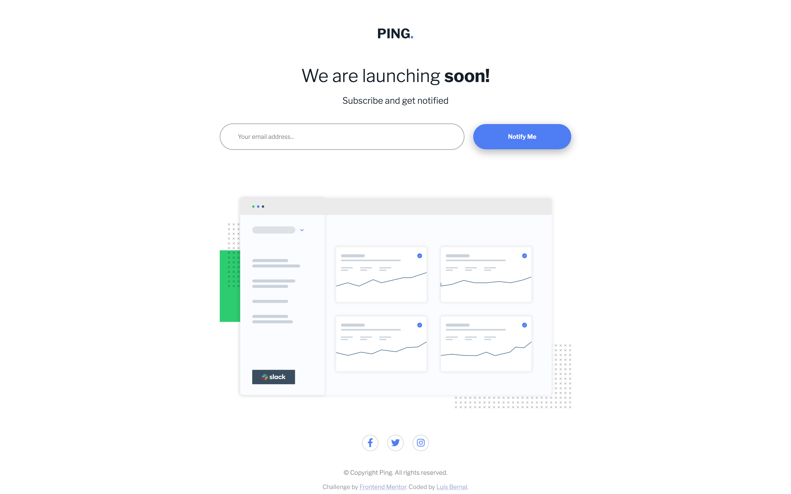

# Frontend Mentor - Ping coming soon page solution

This is a solution to the [Ping coming soon page challenge on Frontend Mentor](https://www.frontendmentor.io/challenges/ping-single-column-coming-soon-page-5cadd051fec04111f7b848da). Frontend Mentor challenges help you improve your coding skills by building realistic projects.

## Table of contents

- [Overview](#overview)
  - [The challenge](#the-challenge)
  - [Screenshot](#screenshot)
  - [Links](#links)
- [My process](#my-process)
  - [Built with](#built-with)
  - [What I learned](#what-i-learned)
  - [Continued development](#continued-development)

## Overview

### The challenge

Users should be able to:

- View the optimal layout for the site depending on their device's screen size
- See hover states for all interactive elements on the page
- Submit their email address using an `input` field
- Receive an error message when the `form` is submitted if:
  - The `input` field is empty. The message for this error should say _"Whoops! It looks like you forgot to add your email"_
  - The email address is not formatted correctly (i.e. a correct email address should have this structure: `name@host.tld`). The message for this error should say _"Please provide a valid email address"_

### Screenshot



### Links

- Solution URL: [https://github.com/FrontendMentor-Lecap/Ping-Coming-Soon-Page-Master]
- Live Site URL: [https://frontendmentor-lecap.github.io/Ping-Coming-Soon-Page-Master/]

## My process

### Built with

- Semantic HTML5 markup
- CSS custom properties
- Flexbox
- CSS Grid
- Mobile-first workflow
- Vanilla Javascript

### What I learned

During this project I learned how to add perfect round borders to fontawesome icons. My technique was to display each of the anchor tags as table cells.

```css
.socials a {
  display: table-cell;
  vertical-align: middle;
  text-align: center;
```

I also continue practiing with DOM and general JS, to show the error messages requested. The code has a function that can be used in any input, not only in the email input, for this particular challenge it is an overkill but it can be replicated in projects with more than one input.

```js
function setErrorFor(input, message) {
  const inputContainer = input.parentElement;
  const errorMessage = inputContainer.querySelector('#error-message');

  // add error message
  errorMessage.innerText = message;
  errorMessage.style.display = 'block';
  input.classList.toggle('error__border');
}
```

I also used another function to test if the email address is valid, instead of making a big function with the regex code I prefered a separate one that could give me more options in the future and a much cleaner approach.

```js
function isEmail(email) {
  return /^(([^<>()\[\]\\.,;:\s@"]+(\.[^<>()\[\]\\.,;:\s@"]+)*)|(".+"))@((\[[0-9]{1,3}\.[0-9]{1,3}\.[0-9]{1,3}\.[0-9]{1,3}])|(([a-zA-Z\-0-9]+\.)+[a-zA-Z]{2,}))$/.test(
    email
  );
}
```

### Continued development

I need to continue practicing with DOM and general Javascript since this is now the subject that I have to research the most in every challenge. Continue developing JS skills will let me create unique websites and advanced functionalities to different elements.
